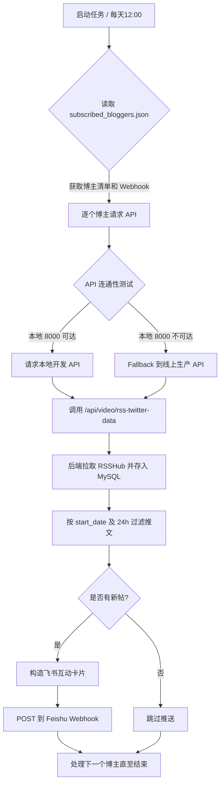

# 推特 RSS 监控飞书卡片群聊推送技能 (`skill-twitter-rss-alert`)

## 1. 项目简介

本技能通过本地化部署的 RSSHub 抓取指定 Twitter/X 博主的最新文章，将数据清洗落库，并在日期过滤后，使用飞书互动消息卡片发送到指定的群聊机器人中。此技能可作为自媒体日常情报监控，帮助团队零成本监控行业专家（如 Levels.io、Marc Louvion、Tony Dinh 等）的动态。

---

## 2. Mermaid 业务流程图



---

## 3. 文件目录结构

```text
skill-twitter-rss-alert/
├── SKILL.md                 # Agent 核心技能描述说明
├── README.md                # 技能详细说明文档
├── .gitignore               # 本地开发忽略列表
├── .env.example             # 环境变量配置模板
└── scripts/
    └── send_twitter_alert.py # 核心推送执行脚本
```

---

## 4. 获取与安装

### 4.1 安装依赖
本技能运行依赖 `httpx` 包，确保环境中已安装：
```bash
pip install httpx
```

### 4.2 本地手动调试运行
```bash
# 获取单个博主的最新帖并推送
python scripts/send_twitter_alert.py --blogger tdinh_me

# 指定日期过滤条件（该日期及以前）与自定义 Webhook
python scripts/send_twitter_alert.py --blogger tdinh_me --date 20260701 --webhook YOUR_WEBHOOK_URL

# 模拟定时任务批量运行（读取配置文件中所有关注的博主）
python scripts/send_twitter_alert.py --cron-run
```

---

## 5. 凭证安全与隔离规范

- **敏感信息屏蔽**：飞书 Webhook 接口 URL 及 Twitter 的 `auth_token`/`ct0` 等登录凭证绝对禁止直接写入仓库或 `SKILL.md` 中。
- **本地配置文件**：博主清单及 Webhook 地址在本地保存在 `subscribed_bloggers.json` 中，该文件名已写入 `.gitignore` 阻断提交。
- **环境变量读取**：核心脚本支持通过环境变量与 CLI 参数直接覆盖，便于流水线与外部系统以零硬编码方式安全调用。

---

## 6. 核心设计决策

1. **API 自动 Fallback 容灾**：
   开发环境（Windows）与生产环境（Linux）环境异构，脚本能根据本地 HTTP 服务状态自适应切换 API 地址，极大方便了本地单步调试与线上正式部署。
2. **先落库再查询的一致性原则**：
   不采用原始解析直接返回，而是遵循统一的数据持久化规范——“API 调用 ➔ 入库 ➔ 数据库过滤读取 ➔ 返回”，确保本地与云端的数据始终处于完整同步且随时可做历史追溯状态。
3. **24 小时增量推送**：
   定时任务每天中午 12:00 运行，仅提取最近 24 小时发布的新推文，若无新消息则跳过发送，避免对团队群组造成重复和空白通知的信息骚扰。
